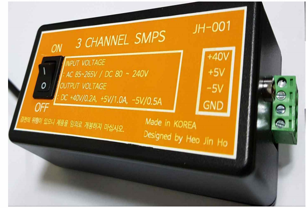

# SMPS

개인으로 프로젝트를 수행하였으며 전체적인 동작은 PWM IC인 TNY279PN의 PWM 발진신호로 초퍼 트랜스를 구동하여 2차측에 전달해 +5V,-5V,+40V가 출력되는 구성입니다. 아울러 안정적인 정전압을 유지하기 위한 피드백 신호는 포토커플러를 사용하여 구현하였습니다.

스위칭 IC : TNY279PN

포토커플러 : PC817

전압 래퍼런스 IC : TL431

수행기간 : 2021.11.01.~2022.01.30

# 제작한 SMPS 및 PCB 

<PI EXPERTS 출력 회로도>

# SMPS 동작 영상

https://youtube.com/shorts/sAFXUCncAM8

# 세부사항 및 포트폴리오

## 동작원리

1. 교류(AC85V ∼ 265V)나 직류(DC80V ∼ 240V) 전압이 인가되면 바리스타로 서지를 막아주고 퓨즈와 서미스터(NTC)는 돌입전류에 의해서 콘덴서 C6가 소손 되는 것을 막아줍니다.
입력신호는 브릿지 다이오드를 거쳐 정류된 후 파이필터에 의해 평활되고 노이즈가 제거 되어 직류 전압이 됩니다.

2. TNY279 내부의 MOSFET이 132KHz로 스위칭 하는 펄스에 따라서 MOSFET가 ON/OFF 스위칭 동작을 하는데 이 때 FET가 ON시 트랜스의 1차측 권선에 전류가 흘러 에너지가 축적되고 FET가 OFF 될 시 축척된 에너지가 2차측 권선으로 출력됩니다. 트랜스와 병렬로 스너버 회로를 연결하여 트랜스로 인한 누설 인덕턴스가 FET의 스위칭에 의해 발생하는 서지를 스너버 회로로 막아줍니다.

3. MOSFET OFF상태일 때 2차로 넘어온 전압은 다이오드를 지나 정류되고 파이필터를 거쳐 평활되어 직류 전압(+40V, +5V, -5V)을 얻습니다. 이때  5V에 다이오드와 병렬연결 된 스너버 회로(다이오드 효율 개선용)는 다이오드 trr(역방향 회복 시간)을  짧게 줄여주는 역할과 ON/OFF시 발생되는 노이즈를 제거해줍니다. MOSFET ON 상태가 되면 2차측에 전압이 넘어오지 않아 파이필터의 C에 저장된 전압이 방전하여 전압을 유지시킵니다.

4. 안정적인 전압을 얻기 위해 포토커플러를 이용해 피드백 제어를 합니다. TNY279의 EN(UV)핀은 HIGH상태 일 때 정상동작하여 2차측 포토커플러의 LED가 OFF 상태여야 합니다. 그러나 출력의 전압이 증가하여 TL431의 REF단자에 들어오는 전압이 증가하면 K단으로 흘러들어오는 전류 즉 포토커플러에 흐르는 전류가 증가하여 ON되어 TR로 전달됩니다. TR이 ON이 되면 TNY279의 EN(UV)핀이 0.2V로 낮아져 LOW상태가 되므로 동작을 중지합니다.

5. 이 상태가 유지되어 2차측 전압이 감소하여 LED로 가는 전류가 감소하고  OFF가 됩니다. 그러면 EN(UV)핀이 다시 HIGH가 되고 TNY279가 다시 정상적인 작동을 하게 되어 FET가 ON/OFF 스위칭으로 안정적인 전압을 얻습니다.

## 결과

1.사전 계획 문제로 인한 효율 문제
   
-> Flyback 방식 뿐만 아니라 모든 SMPS 회로의 효율 개선을 위하여서는 먼저 설계하려는 SMPS의 전력을 계획한 후 그에 맞게 트랜스 코어, 갭, 권선비, 권선비에 따른 감는 횟수, 권선 두께, 트랜스 1, 2차 인덕턴스 등을 고려한 트랜스 설계가 필요합니다. 이것을 뼈대로 하여 스위칭 소자에 걸리는 서지 전압과 스너버 회로 사이의 효율 손실 계산, 누설 인덕턴스로 인해 2차 다이오드에서 생기는 스위칭 노이즈 개선 등의 정량적 연구개발이 수행되어야 합니다. 또한 리플이 많은 Flyback 방식의 특성 상 리플을 고려한 평활 콘덴서 선정 및 적정 필터 사용이 과제입니다.
   
-> 그러나 첫째로 이번 프로토타입이 SMPS 연구개발의 첫 공부이자 첫 시도여서 위와 같은 설계를 모두 고려하기에는 무리가 있었고, 둘째로 220V 전력 공급원을 사용하며 스위칭 레귤레이터 사용으로 인해 열적 손실이 적으므로, 효율 개선보다는 일단 정성적 동작 및 안전성 위주의 설계를 진행하였습다.

-> Flyback 방식은 트랜스 1차 코일에서 바로 2차 코일로 에너지를 전달하는 Forward converter 방식과는 달리 1차 코일에서 코어로 한번 저장된 에너지가 2차 코일로 넘어가므로 그에 따른 태생적 효율 저하가 있습니다. 또 이번 설계에서 사용한 TNY279PN Flyback IC는 듀티비보다는 스위칭 주파수를 최대 132 kHz까지 조정함으로써 전력을 전달하므로 스위칭 손실이 많아 SMPS 효율이 높지 않다. 실제로 TNY279PN 데이터시트에 명기된 효율은 75% 수준으로, 일반적인 SMPS 효율에 비해서 낮다. 311V의 DC 전압을 40V, 5V 수준의 저전압으로 전환시키는 것도 낮은 효율의 원인입니다. 이런 낮은 효율 문제 또한 정성적 설계의 이유입니다. 

2.고부하 측정시 출력저하

-> 전체 소비전력인 21.8w에서 15.5w 만큼의 71% 효율을 가진 smps를 설계하려 하였으나  피드백이 구성된 부분은 풀로드인 5옴으로 했을 때 목표로하는 5v/1a가 측정되어 5w가 출력되었으나 40v/0.2a 인 8w 중에서  최대전력을 측정하기위해 풀로드인 200옴을 사용햇을 때 30v가 출력되었다 33의제곱/200인 5.5w가 출력되었습다. -5v/0.5a에서는 10옴으로 했을 때 -3.5v가 출력되었습니다. 이말은 1.2w이니 전체 5.5+5+1.2= 11.7w로 53%의 효율을 가진다는 말입니다. 거의 18%가 떨어진건데 이것은 5v에서는 원하는 출력이 피드백으로 유지되었으나 피드백회로가 없는 40v와 -5v에서는 원하는 출력을 이루지 못하였습니다. 오실로스코프 상에서 5v의 경우 직류전압 형태가 측정되었으나 -5v의 경우 삼각파형태로 피크전압이 2v 가까이 높게 나오며 불안정한 전압이 출력되었습니다.

-> 스위칭 레귤레이터에서 부하가 증가하면 IC는 스위칭 주파수를 높여서 전력 전달을 증가시키려고 합니다. 이는 출력 전압을 일정하게 유지하기 위한 조치입니다. 하지만, 풀로드인 고부하 상태에서 출력 전압이 감소하는 현상은 스위칭 주파수가 과도하게 높아져서 발생할 수 있습니다. 

-> 이를 방지하기 위해 피드백 메커니즘이 중요한데, 이는 전류가 기준치를 초과할 때 스위칭을 일시적으로 멈추어 전류를 조절합니다. 피드백 없이 주파수가 증가하면 스위칭 노이즈와 관련된 전력 소모가 증가하고, 이는 부하 측의 전력 소모를 감소시켜 결과적으로 출력 전압과 전류를 낮추게 됩니다. 따라서, 피드백 메커니즘은 스위칭 레귤레이터의 성능을 최적화하는 데 중요한 역할을 합니다. 원하는 출력 목표를 달성하기 위해서는 사전 계획단계에서 IC의 특성을 꼼꼼하게 파악해 피드백 회로를 각각 구성할 필요성을 느꼈습니다.

3.노이즈와 노이즈 대책의 이해

-> 전원회로 특성 상 여러 노이즈 방지 부품이 필요합니다. 대부분의 노이즈는 인덕턴스와 커패시턴스로 인한 노이즈임을 파악해 전자회로와 회로이론의 수식들이 실무에서 어떻게 적용되는지 이해하였습니다.

-> 인덕턴스와 커패시턴스에 대한 이해를 바탕으로 전원에 퓨즈와 서미스터를 사용하여 돌입전류를 제한하고 바리스터를 이용해 서지 전압을 해결했습니다. 공통모드 노이즈와 차동모드 노이즈의 경우 라인필터와 X커패시터를 활용하여 해결하였고, 스위칭IC인 TNY279PN 내부의 MOSFET 스위칭으로 인해 발생하는 서지전압을 스너버회로로 해결했습니다.

## BOM

## 원가 분석표

